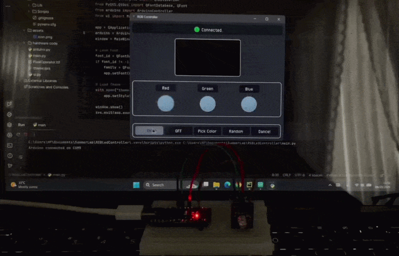
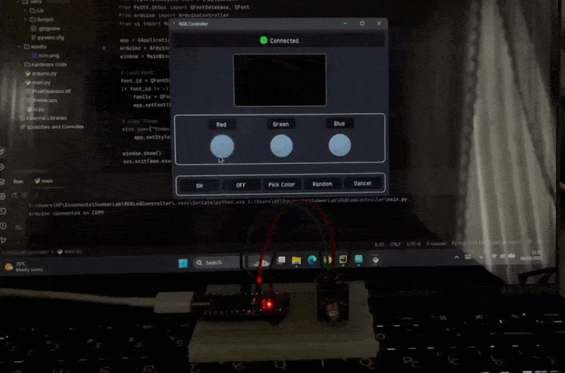
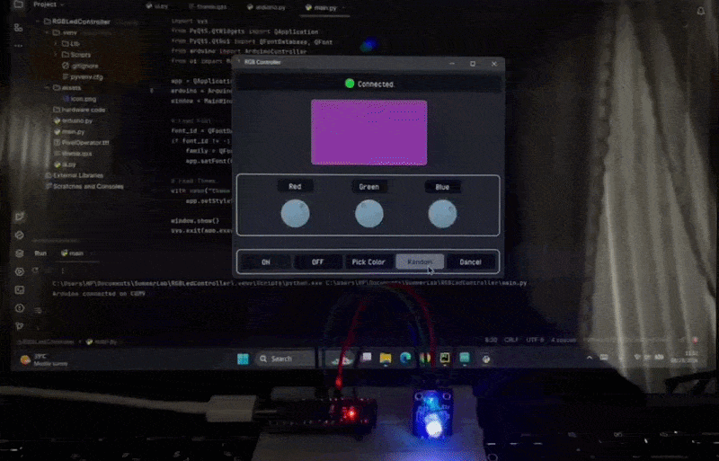
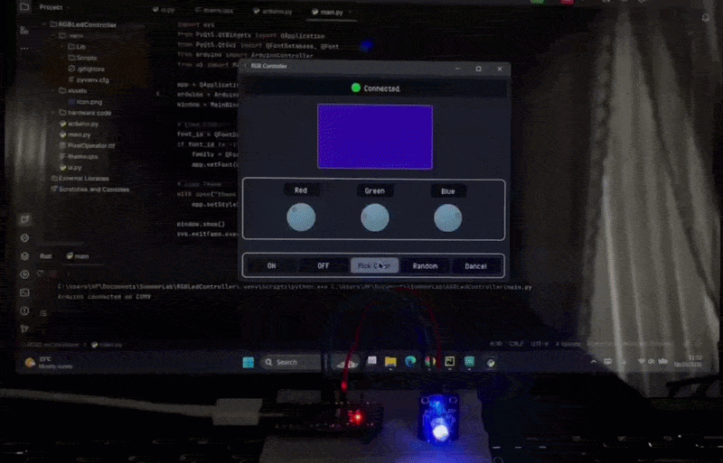
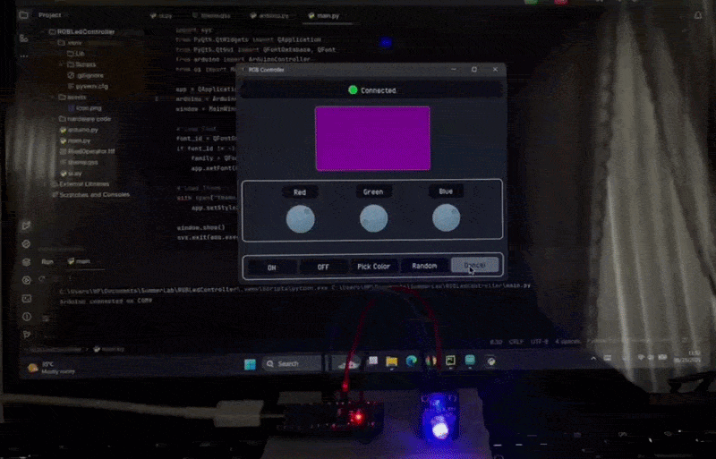

# 🎨 RGB LED Controller

  Control an RGB LED from a custom desktop GUI, adjust its color and brightness through a desktop App!

A desktop RGB LED controller built with **Python, PyQt5, and Arduino**.
This project lets you control an RGB LED from a custom desktop GUI, adjust its color and brightness, and communicate with the Arduino through a serial connection.

## ✨ Features

* RGB color selection
* LED brightness control
* Independent RGB channels
* Interactive PyQt5 interface
* Automatic Arduino serial-port detection
* Serial communication between Python and Arduino
* Real-time LED control
* PWM-based brightness control

## 🛠️ Technologies

### Software

* Python
* PyQt5
* PySerial
* Qt Style Sheets (QSS)

### Hardware

* Arduino UNO
* RGB LED
* USB connection

## ❓ How It Works?

The application is divided into two main parts:

### Python GUI

The PyQt5 application provides the user interface and handles:

* Color selection
* Brightness adjustment
* User interactions
* Serial-port detection
* Sending RGB values to the Arduino

### Arduino

The Arduino receives RGB values through the serial connection and controls the LED using PWM. The basic communication flow is:

PyQt5 GUI
    │
    │ RGB values
    ▼
Serial Connection
    │
    ▼
Arduino
    │
    ├── Red PWM
    ├── Green PWM
    └── Blue PWM
            │
            ▼
         RGB LED

The RGB LED is controlled using three PWM-capable Arduino pins.

| Channel  | Arduino Pin |
| -------- | ----------: |
| 🔴 Red   |         `3` |
| 🟢 Green |         `5` |
| 🔵 Blue  |         `6` |

## 📼 Demo

### ON and OFF Buttons

  

### Dials

  

### Random Button

  

### Color Picker Button

  

### Dance Button

  

## ✨ Author & License

**Parnian Ghorbani**

This project is open-source and available for learning and educational purposes however; If you use this project or its ideas in your own work, please consider mentioning this repository and giving it a star. :)
